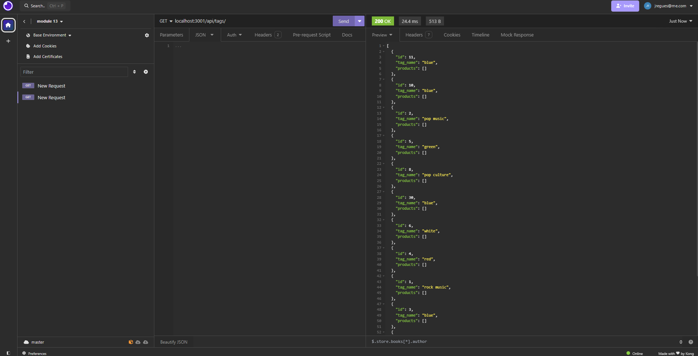
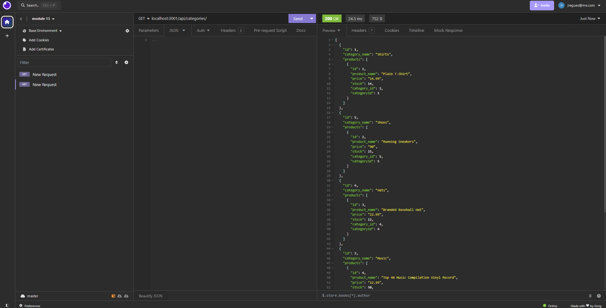
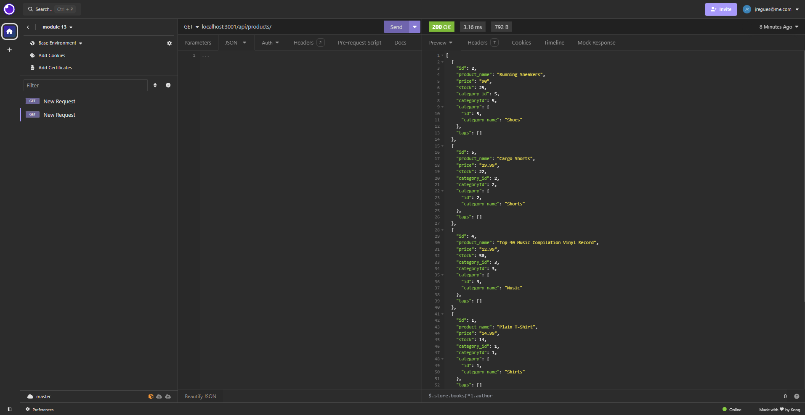

## E-Commerce Back End Application

# About
This assignment was created for my Module 13 Challenge assignment, in which I was requested to create the back-end code for an E-Commerce application. This application uses sequelize, postgreSQL and Node.js. This was created in accordance to the following User Story and Acceptance Criteria.

# User Story
```
AS A manager at an internet retail company
I WANT a back end for my e-commerce website that uses the latest technologies
SO THAT my company can compete with other e-commerce companies

```

# Acceptance Criteria
```
GIVEN a functional Express.js API
WHEN I add my database name, PostgreSQL username, and PostgreSQL password to an environment variable file
THEN I am able to connect to a database using Sequelize
WHEN I enter schema and seed commands
THEN a development database is created and is seeded with test data
WHEN I enter the command to invoke the application
THEN my server is started and the Sequelize models are synced to the PostgreSQL database
WHEN I open API GET routes in Insomnia for categories, products, or tags
THEN the data for each of these routes is displayed in a formatted JSON
WHEN I test API POST, PUT, and DELETE routes in Insomnia
THEN I am able to successfully create, update, and delete data in my database

```

# Screenshots







# How to Use

Run 'npm install' to install all dependencies, then log into your postgres terminal and run '\i db/schema.sql'. Once you have the database installed, run 'node seeds/index.js' to seed the data and tables into the database and then run 'npm start' or 'nodemon server.js' if you have nodemon installed globally to start the server. Then you will be able to make GET, POST, PUT, and DELETE calls in insomnia. The endpoints are '/api/categories', '/api/products', and '/api/tags'.

# Links

https://github.com/jregues/E-Commerce-back-end/tree/main
